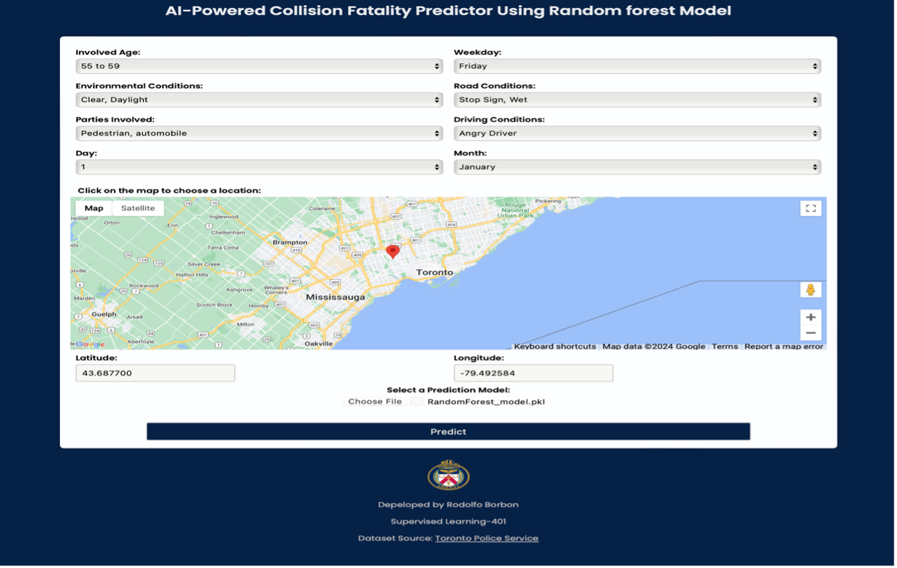
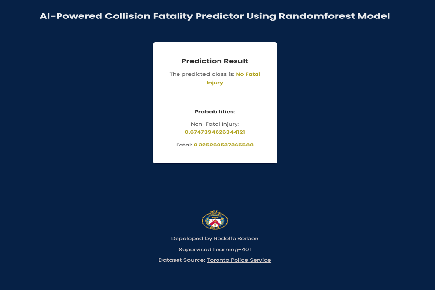

# Toronto Police Service Collision Fatality Predictor

A machine learning application that predicts the likelihood of fatal injuries in traffic collisions using various prediction models.

## Project Overview

This Flask-based web application allows users to predict whether a traffic collision is likely to result in fatal injuries based on various parameters such as:

- Age of involved parties
- Day of week and month
- Environmental conditions
- Road conditions
- Parties involved
- Driving conditions
- Geographic location (latitude and longitude)

The application uses trained machine learning models that can be uploaded by the user.




## Features

- Interactive web interface for data input
- Google Maps integration for location selection
- Support for custom ML model uploads
- Probability scores for predictions
- Responsive design

## Setup and Installation

### Prerequisites

- Python 3.7+
- pip (Python package manager)

### Installation Steps

1. Clone the repository:

   ```
   git clone <repository-url>
   cd FlaskAPI_RodolfoBorbon
   ```

2. Create a virtual environment:

   ```
   python -m venv venv
   source venv/bin/activate  # On Windows: venv\Scripts\activate
   ```

3. Install dependencies:

   ```
   pip install -r requirements.txt
   ```

4. Create a `.env` file in the project root with your Google Maps API key:

   ```
   GOOGLE_MAPS_API_KEY=your_api_key_here
   ```

5. Create the uploads folder:
   ```
   mkdir uploaded_models
   ```

## Running the Application

1. Ensure your virtual environment is activated
2. Run the Flask application:
   ```
   python app.py
   ```
3. Access the application in your browser at `http://localhost:5000`

## Usage

1. Fill in the form with collision details
2. Upload a trained model file (.pkl format)
3. Click "Predict" to see the prediction results

## Project Structure

- `app.py`: Main Flask application
- `templates/`: HTML templates
  - `index.html`: Input form
  - `result.html`: Prediction results
- `static/`: Static assets
- `uploaded_models/`: Directory for uploaded model files

## Dataset

This project uses data from the Toronto Police Service's KSI (Killed or Seriously Injured) dataset.

## Developer

Developed by Rodolfo Borbon for Supervised Learning-401

## License

This project is part of the Artificial Intelligence Program at Centennial College.
